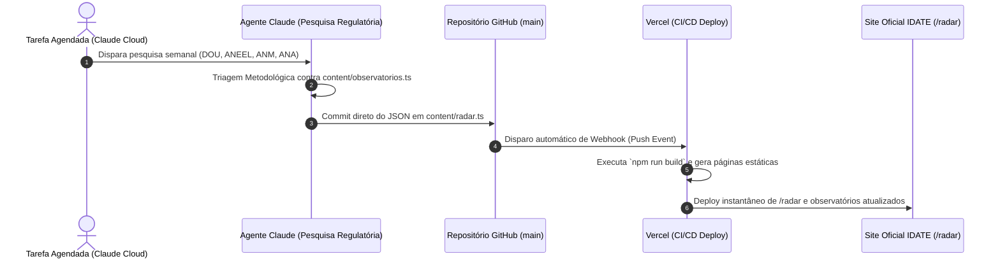

# Guia de Automação: Conexão da Tarefa Agendada do Claude com o Site IDATE

Este documento orienta a integração contínua entre a **pesquisa semanal automatizada do Claude** e a **atualização automática do site do IDATE na Vercel**.

---

## 1. Como Funciona o Pipeline Automático



---

## 2. Estrutura do Payload JSON Gerado pelo Claude

Ao final da pesquisa de cada ciclo, o Claude deve produzir a estrutura JSON validada abaixo:

```json
{
  "id": "ciclo-2026-08-17-2026-08-24",
  "periodo": {
    "inicio": "2026-08-17",
    "fim": "2026-08-24",
    "rotulo": "17 a 24/08/2026"
  },
  "fontesVigiadas": ["DOU", "ANM", "ANEEL", "ANA"],
  "itens": [
    {
      "id": "aneel-ato-exemplo-2026",
      "titulo": "Título do ato publicado na agência reguladora",
      "fonte": "ANEEL (Despacho nº XXX/2026)",
      "orgao": "ANEEL",
      "publicadoEm": "2026-08-18",
      "url": "https://www.gov.br/aneel/...",
      "resumo": "Resumo analítico com o impacto financeiro/normativo.",
      "observatorio": "energia",
      "perguntaVinculada": "Como os encargos setoriais se distribuem entre as classes de consumo?",
      "empresasCitadas": ["Distribuidora X"],
      "valorEnvolvido": "R$ 100.000.000,00"
    }
  ],
  "analises": [
    {
      "observatorio": "energia",
      "tema": "Tema da vigilância semanal",
      "status": "em_observacao",
      "statusRotulo": "Lead de Monitoramento — Triagem Aberta",
      "resumo": "Análise técnica de maturidade do tema.",
      "criterios": {
        "recorrencia": {
          "status": "em_maturacao",
          "titulo": "Recorrência documentada",
          "detalhe": "Avaliação da série temporal."
        },
        "relevanciaColetiva": {
          "status": "atendido",
          "titulo": "Relevância coletiva",
          "detalhe": "Impacto sobre consumidores/empresas."
        },
        "viabilidadeApuracao": {
          "status": "atendido",
          "titulo": "Viabilidade de apuração",
          "detalhe": "Fontes documentais disponíveis."
        }
      },
      "parecerTecnico": "Encaminhamento institucional."
    }
  ],
  "itensDescartados": [
    {
      "titulo": "Manchete descartada",
      "fonte": "DOU",
      "orgao": "DOU",
      "publicadoEm": "2026-08-19",
      "motivoDescarte": "Ausência de conexão com perguntas em aberto."
    }
  ],
  "fontesSemOcorrencias": [
    {
      "orgao": "ANA",
      "url": "https://gov.br/ana",
      "observacao": "Sem atos relevantes publicados na janela de 7 dias."
    }
  ]
}
```

---

## 3. As 3 Formas de Conectar o Claude ao Repositório

### Forma 1: Push Direto via GitHub API (Recomendada)
Na automação do Claude (ex: script Python, Make, Zapier ou Claude Tool Use), adicione um passo final que faz a chamada à API do GitHub:

* **Endpoint**: `PUT https://api.github.com/repos/nelsonbortolin/idatev2/contents/content/radar.ts`
* **Headers**:
  * `Authorization: Bearer <SEU_GITHUB_TOKEN>`
  * `Accept: application/vnd.github+json`
* **Resultado**: O commit entra na branch `main` e a Vercel publica o site em menos de 1 minuto.

### Forma 2: Webhook Endpoint do Next.js
O site agora conta com a rota `POST /api/radar/ingest`:
* **Endpoint**: `https://idate.org.br/api/radar/ingest`
* **Header**: `Authorization: Bearer <RADAR_SYNC_SECRET>`
* **Body**: JSON com o ciclo apurado.

### Forma 3: GitHub Actions Dispatch
Disparar o workflow `.github/workflows/radar-sync.yml` via API do GitHub:
```bash
curl -X POST \
  -H "Authorization: Bearer $GITHUB_TOKEN" \
  -H "Accept: application/vnd.github.v3+json" \
  https://api.github.com/repos/nelsonbortolin/idatev2/dispatches \
  -d '{"event_type":"radar_update"}'
```

---

## 4. Prompt Pronto para a Tarefa do Claude

Copie e cole a instrução abaixo na sua rotina agendada do Claude:

> "Você é o agente de inteligência regulatória do IDATE.
> Realize a vigilância semanal dos atos e notícias oficiais publicados nos últimos 7 dias nos seguintes órgãos: DOU, ANM, ANEEL, ANA, STF e STJ, focando nos eixos Água, Terra e Energia.
>
> Avalie cada ato contra a agenda de pesquisa dos observatórios do IDATE (energia, aguas, terras, recursos-minerais, tarifas-publicas, transicao-energetica, etc.).
> 
> Aplique os 3 critérios de metodologia IDATE (Recorrência documentada, Relevância coletiva e Viabilidade de apuração documental).
> 
> Além de redigir o resumo executivo para envio por e-mail, produza e entregue a estrutura JSON padronizada do ciclo (conforme content/radar.ts) para atualização automática do repositório."
